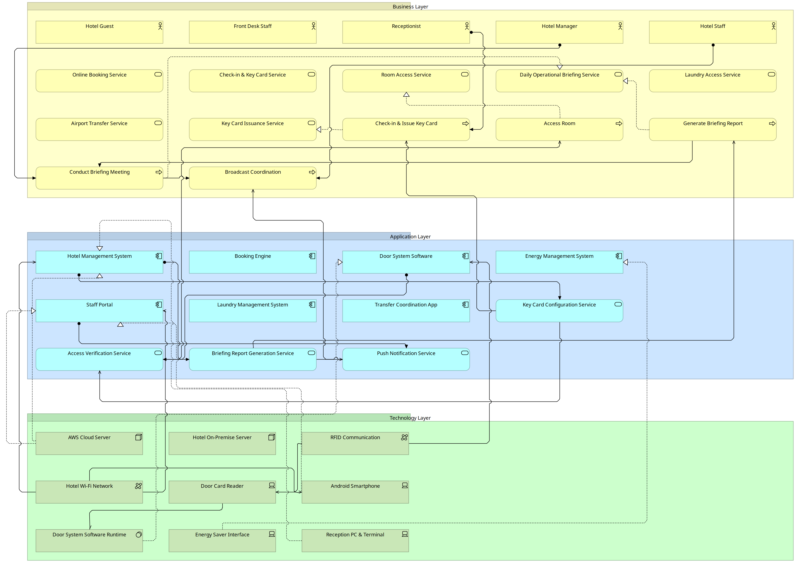
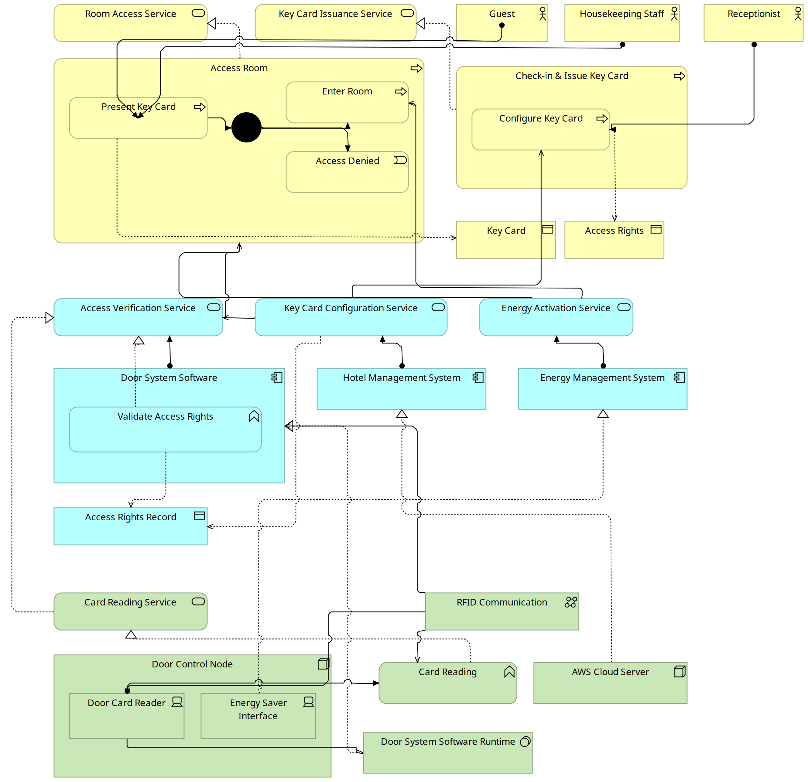
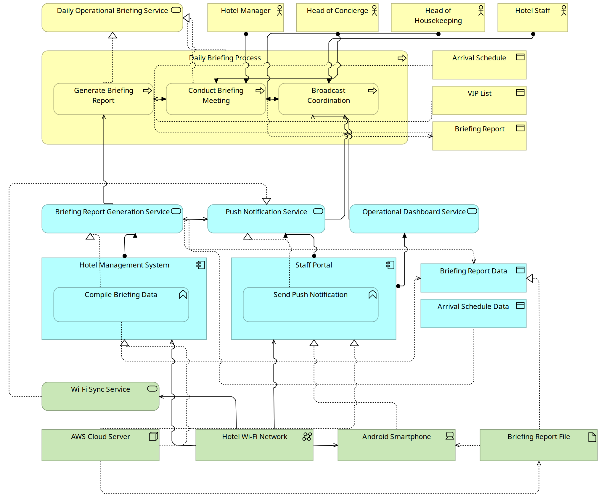
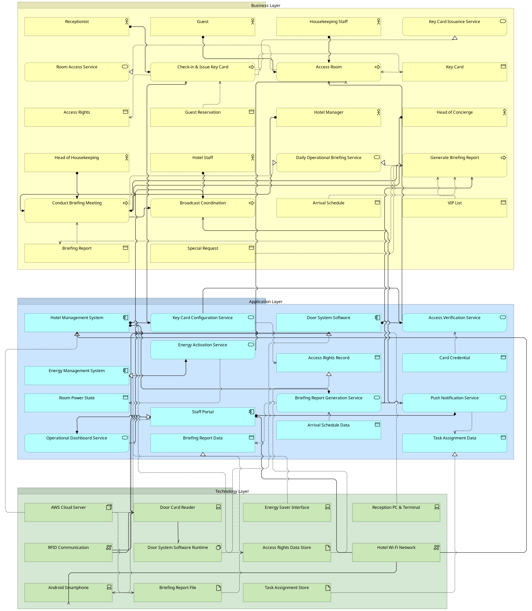

# ArchiHotel — Enterprise Architecture Model (Focus 2)

ArchiMate 3.2 model for the **C2 ArchiHotel — "Genesis Files"** case
(EAM, TUM Chair of Information Systems Heilbronn).

**Focus 2: Room Access & Daily Briefing** — modeled across the Business,
Application, and Technology layers, plus a whole-enterprise overview.

Case source: <https://archihotel-eam.web.app/>

---

## Repository contents

| File | Description |
|------|-------------|
| [`ArchiHotel.archimate`](ArchiHotel.archimate) | The Archi model (open in [Archi](https://www.archimatetool.com/) 5.7+). Contains all 4 views below. |
| [`Focus2_RoomAccess_DailyBriefing.md`](Focus2_RoomAccess_DailyBriefing.md) | Case-material extraction, roles/inputs/outputs breakdown, ArchiMate element inventory, and the presentation script. |
| [`images/`](images/) | PNG exports of each view. |

## Views

### 1. Abstract EA — Enterprise Overview
High-level view of the whole hotel (all six domains, three layers) for the introduction.

### 2. Room Access — Layered (detailed)
Business → Application → Technology, with the key-card access flow:
present card → verify access rights → **decision** → enter room / access denied.

### 3. Daily Briefing — Layered (detailed)
Business → Application → Technology, with the morning flow:
generate briefing report → conduct meeting → broadcast coordination to staff phones.

### 4. Focus 2 — flat (backup)
Original single-canvas view of both sub-domains, kept for reference.

---

## Modeling conventions

- **Layer alignment** — Business (yellow) / Application (blue) / Technology (green), connected top-to-bottom.
- **Direct actor → process** assignment (no intermediate role), per the case narrative.
- **Nesting** — process steps inside their parent process; functions inside components; devices inside the node.
- **Behavioural flow** — triggering relationships with a junction for the allow/deny branch; a business event for "Access Denied".
- **Relationship types** follow ArchiMate 3.2: application service *serves* business process; function *realizes* service; technology *realizes* application; device *assigned to* function; node *composed of* devices.

## How to open

1. Install [Archi](https://www.archimatetool.com/) (5.7 or newer).
2. **File → Open** → `ArchiHotel.archimate`.
3. Expand **Views** in the model tree and double-click any view.
